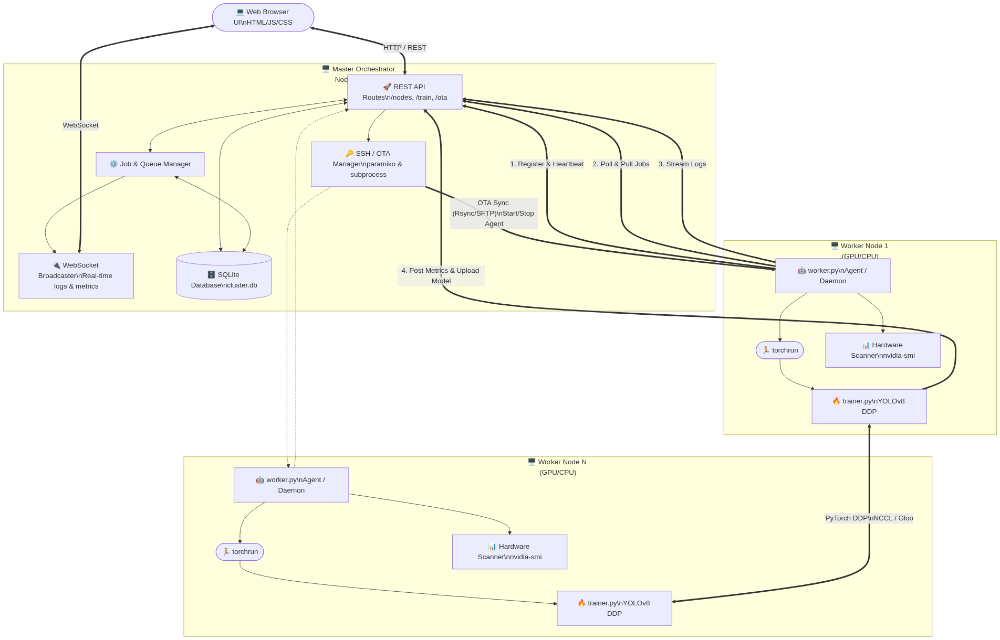

# Cactus Distributed Model Training Orchestrator

Cactus is an end-to-end distributed deep learning orchestrator built specifically for scaling YOLOv8 training across multiple machines in a cluster. It offers a fully integrated experience, abstracting away the complexities of Distributed Data Parallel (DDP), network communication, SSH management, and node telemetry into a centralized, beautiful real-time web dashboard.

---

## Key Features

### 1. Zero-Touch Worker Provisioning
Forget about manual dependency hell. We provide a single `install.sh` script for worker nodes that:
- Installs all missing system packages (SSH, Python, venv).
- Installs PyTorch, CUDA bindings, and Ultralytics.
- Installs and enables a persistent `cactus-worker` systemd service for reliable background execution.
- Configures necessary network and directory permissions automatically.

### 2. Centralized Master Dashboard
The Master Orchestrator runs a FastAPI backend with an integrated, highly-responsive vanilla JS dashboard. From this dashboard you can:
- **Monitor Telemetry:** View live GPU utilization, VRAM usage, and core temperatures across the entire cluster.
- **Track Jobs:** Watch real-time training progress, mAP@50 curves, and loss metrics without ever touching a terminal.
- **Manage Logs:** Stream stdout and stderr logs from all remote nodes directly into the browser.

### 3. Frictionless Cluster Registration
Adding a node to the cluster is as simple as typing its IP address and password. The system handles:
- **Automated Authentication:** Connects via password to inject the Master's public SSH key directly into the worker's `authorized_keys`. Subsequent connections are completely passwordless.
- **Hardware Discovery:** Automatically runs `nvidia-smi` to discover the exact GPU count and architecture before registering the node.

### 4. Over-The-Air (OTA) & Offline Code Syncing
Keep your cluster perfectly in sync:
- **One-Click OTA:** The Master pushes the latest `worker/` directory via SFTP to all active nodes concurrently.
- **Offline Zipping:** Generate a zipped deployment package directly from the UI to share manually via USB or email with air-gapped worker machines.

### 5. Automated Systemd Process Management
Start, stop, and restart the background Python worker agent running on remote nodes via SSH from the UI. The orchestrator uses robust `systemctl` commands to ensure the node is always listening for DDP instructions.

---

### System Architecture



### Component Breakdown

- **Master Node (FastAPI):** Central orchestrator that manages SQLite records, distributes code (OTA) over SSH, delegates jobs, and streams live websockets.

- **Worker Agents:** Lightweight daemons running on edge nodes that report hardware telemetry, pull jobs from the queue, and stream logs.

- **torchrun Trainer:** PyTorch DDP scripts that coordinate peer-to-peer (via NCCL/Gloo) to execute distributed YOLOv8 workloads.

---

### Quick Start & Setup

For full installation instructions, please refer to the [Setup Guide](setup_guide.md).

### Master Setup:
```bash
# 1. Install dependencies on Master
sudo apt install python3-venv python3-pip sqlite3

# 2. Run backend
cd backend
python3 -m venv venv && source venv/bin/activate
pip install -r ../requirements.txt
python3 main.py
```

### Worker Setup:
Copy the `worker/` folder to the target machine.
```bash
cd worker
chmod +x install.sh
./install.sh
```

---

## License
This project is proprietary. All rights reserved.
